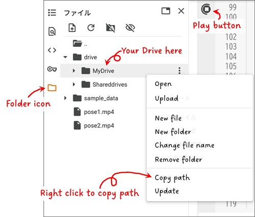

# TRAC3D: Tracking and Recognition of Actions in Communication 3D
Welcome! This guide will walk you through creating 3D visualizations of human motion from 2D videos. You will use two web-based tools: one for camera calibration and another for 3D pose estimation.  
No deep technical knowledge is required. Just follow the steps below, and you'll be on your way to analyzing movement in 3D!

First code for camera calibration 

Second code for pose estimation and motion visualization 

---

## **Part 0: Getting Started with Google Colab**
First, let's get familiar with the environment where you'll run the code: _Google Colab_.  
Of course, if you are already familiar with Colab, you can skip this part.

### **What is Google Colab?**  
Think of Google Colab as a free online code editor that runs in a web browser. You don't need to install anything on your computer. All you need is a Google account and a web browser. You'll work with _notebooks_, which are files containing text and runnable code cells.

### **How to Use a Colab Notebook**
1.  **Open the notebook:** You will be provided with links to two .ipynb notebook files. Open them in Google Colab.
2.  **Run a code cell:** The code is divided into blocks called _cells_. To run a cell, either hover over it and click the play button on the left (something like :arrow_forward: ) or select the cell and press Shift + Enter.
3. **Run cells in order:** It is important to run the cells from top to bottom because each step often depends on the one before it.

### **Essential Colab Skills**
**Connecting to Your Google Drive:** Upload the videos you want to analyze to your Google Drive. Then, give your Colab notebook permission to access them.
1.  Run the cell containing the code `drive.mount('/content/drive')`.
2.  A dialog box should pop up asking for your authorization. If everything is OK, please accept it. Your Drive is now connected.

**Finding a File's Path:** The code needs to know the exact location of your video files. This is called a _file path_.
1.  After mounting your Drive, click the folder icon ( :file_folder: ) on the left panel in Colab.
2.  Navigate through `drive` -> `MyDrive` and find your uploaded video file.
3.  Right-click on the file and select _Copy path_.
4.  Paste this path into the code where needed.

---

## **Part 1: Camera Calibration**
:dart:Goal: Before you can analyze motion, you need to teach the software about your cameras—their lens properties and their exact positions and angles relative to each other. This process is called _camera calibration_.

### **Step 1: Generate and Print Your Calibration Board**
1.  Open the first notebook 
2.  In the second user configuration cell, you can adjust the properties of the board if you wish.
3.  Run the first few cells until the `charuco_board.png` image is displayed and saved.
4.  Download this image and print it. For best results, tape it onto a flat, rigid surface like cardboard or foam board.

### **Step 2: Film Your Calibration Video**
There are two types of calibration: **intrinsic** and **extrinsic**. Example frames for each type are shown below.  
**Intrinsic calibration** corrects for lens distortion of a single camera. This is usually done once per camera. You film by moving the camera around a fixed board.

**Extrinsic calibration** determines the relative positions and orientations between two cameras. This must be done each time the camera setup changes. You film by moving the board in front of two fixed cameras.

#### **Filming Tips:**
* **Video Quality and Board Size:** Record at a good resolution (e.g., 1080p) and a consistent frame rate (e.g., 30 FPS). Ensure both cameras use the same settings. Pay attention to the distance between the participant and the camera. If the distance is great, a larger board will be needed. You may also need higher image quality to ensure the board is detected correctly. You can reduce the number of squares and make each one larger. If the distance is short, as in the example I show, the calibration process is easy.
* **Turn Off Auto Settings:** In your camera settings, disable Autofocus (AF) and Auto White Balance (AWB). Set the focus manually to the distance where the participant would be. This prevents the camera from changing settings during recording, which would ruin the calibration.
* **Cover All Angles:** Slowly and smoothly move the camera (intrinsic) or board (extrinsic) so it's visible in all corners and at various angles and distances in both camera views. Make sure to tilt it forwards, backward, left, and right. The board needs to be moved in the area where the participant will move. Aim for a 30-60 second video.
* **Move the Camera, Not the Board (for intrinsic calibration)**: Place the board in a fixed position. Then, capture the board from many different angles and distances by moving the camera around it. Tilting the camera is crucial because it helps the software accurately model lens distortion.
* **Move the Board, Not the Cameras (for extrinsic calibration):** Place your two cameras in their final, fixed positions. Do not move them during or after calibration. To capture the video, move the printed board around in front of them.
* **Synchronize Two Videos (for extrinsic calibration only):** Start recording on both cameras at the same time. A simple trick is to clap your hands once in front of both cameras right after you start recording and just before you finish recording. This sound spike will help you sync them later if needed.

### **Step 3: Run the Calibration Code**
1.  Upload your calibration videos to your Google Drive. Assuming four videos (two for internal and synchronized two for external).
2.  Copy their file paths and paste them into the "File paths" section of the notebook.
3.  Run all the cells in the notebook from top to bottom.
4.  At the end, the script will save your calibration data to the path you specified. You are now ready for the next stage! :sunglasses:

---

## **Part 2: 3D Pose Estimation**
:dart:Goal: Now, you will use your calibrated cameras to record a person and visualize their movements in 3D space.

### **Step 1: Film Your Participant**
1.  **Keep the Cameras Fixed:** Use the exact same camera setup from the calibration step. Do not move the cameras.
2.  **Record the Participant:** Have a person be in the view of both cameras and perform the actions you want to analyze. Make sure their entire body, or at least their upper body, is visible in both views throughout the video.
3.  **Again, Synchronize:** Just like before, start and end both recordings at the same time on the frame level.

### **Step 2: Run the Pose Estimation Code**
1.  Open the second notebook 
2.  Upload your two new videos (of the participant) to your Drive.
3.  Update the file paths in the code. Make sure the path to your calibration data from Part 1 is also correct.
4.  Run all the cells in order. This process may take some time, as it analyzes every frame of your videos. **If your input video is too long, you may exceed Colab's memory limit, which could result in your session being terminated**.

### **Step 3: 3D Visualizations**
1.  **Wrist Trajectories Plot:** This shows a reference skeleton of the participant's average position and their wrist trajectories. The colored lines trace the path of the participant's right (red) and left (blue) wrists through 3D space. The color gets darker along the path, showing the direction of movement over time.
2.  **3D Heatmap:** The colored blocks represent a heatmap. Areas with more solid blocks are where the participant's hands spent the most time. This is great for identifying common gesture zones. **If _grid_resolution_ is too large, you may exceed Colab's memory limit, which could result in your session being terminated**. We recommend starting with a small value.

You can drag on these plots to rotate the view and see the visualizations from any angle.

Congratulations :tada: You have successfully captured and visualized motion in 3D.

## Citation
Naoto Ienaga, Kazuki Sekine. (2025). Automatic measurement of gestures space. _The 10th Conference of the International Society for Gesture Studies (ISGS)_. Nijmegen, The Netherlands. (Poster Presentation)

### Additional Sources (in Japanese)
1.  家永直人, 関根和生. (2024). 身振りの三次元計測に向けた簡便な手法の比較検討 (Comparative Study of Easy-to-use Methods for 3D Measurement of Gestures). _電子情報通信学会総合大会 (IEICE General Conference)_.
2.  家永直人, 関根和生. (2025). 身振り空間の三次元解析に向けた姿勢推定手法 (Pose Estimation Method for 3D Analysis of Gesture Space). _日本認知科学会第42回大会 (The 42nd Annual Meeting of Japanese Cognitive Science Society)_. (Poster Presentation)
